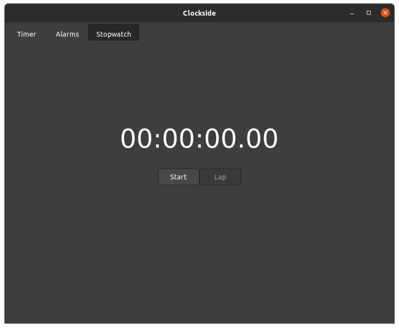

Welcome to my first blog.  
I will be trying to post a blog everyday about the problems I'm having while working on my projects or any interesting thing I think of.

<!--truncate-->

## Clockside
I'm working on a clock application called **Clockside** in _Python_ with a simple timer, alarms and stopwatch.  
I was developing it using [_wxPython_](https://wxpython.org/), which is a GUI _Python_ library that supports native GUI (looks different on different platforms), but I wasn't able to make it look the way I wanted to and as it supported native GUI I wasn't able to modify the widgets to make them look better (or that's what I understood).  

So I was thinking which GUI library I could change to:    
- _GTK_: _GTK_ is beautiful for _Linux_ but I messed up with it when working on **Nihongo Search** (blog about it soon) because there were a really few examples of _GTK_, and non of them were about the widgets I was using, also I had some bugs so I felt it is not beginner-friendly, like it doesn't have a complete _Python_ guide either resources.  
- _PyQt_: I'm more experienced with PyQt since I've made some applications with it, and it has a really good documentation and lots of resources.  
So I'm switching to _PyQt_.

**Note:** I will create a tutorial/blog of how did I create **Clockside** soon.

## Docusaurus
If you didn't notice, this website (including the blog) was made using [_Docusaurus_](https://docusaurus.io/) which is a project for building, deploying, and maintaining open source project websites easily.  
I did use it to create [**PREFS** _Python_ library](https://patitotective.github.io/PREFS/) website too and for me it looks so good that I decided to use it for this website too.

***
As you may have noticed I'm not the best at writing blogs, so I will be watching videos and learning about it to improve myself.

If you have any suggestion or want to share feedback, contact me at:
- _Twitter:_ [@patitotective](https://twitter.com/patitotective).
- _Discord:_ Patitotective#0127.
- _Email:_ cristobalriaga@gmail.com

Or to keep fully updated join my [_Discord_ server](https://discord.com/invite/as85Q4GnR6).
